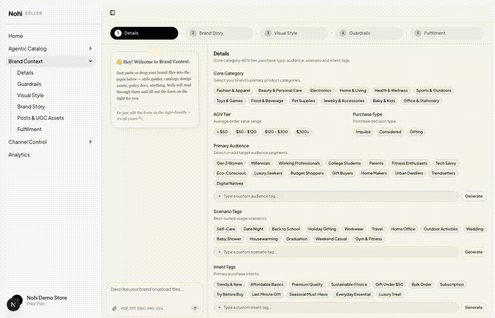
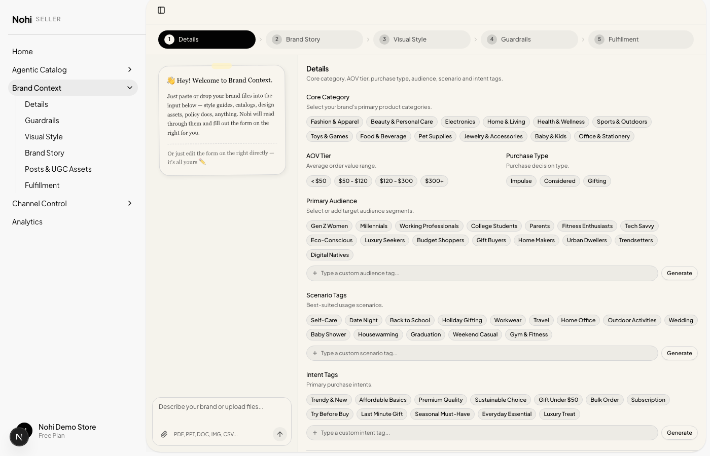
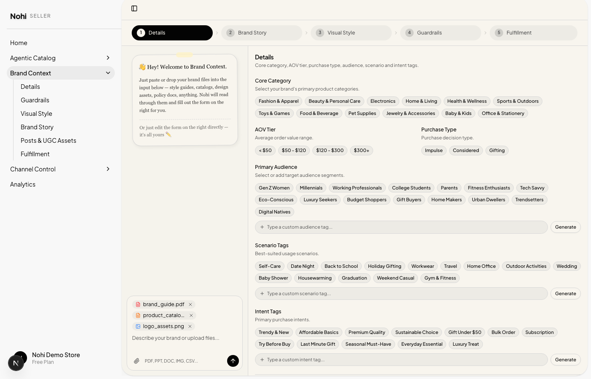
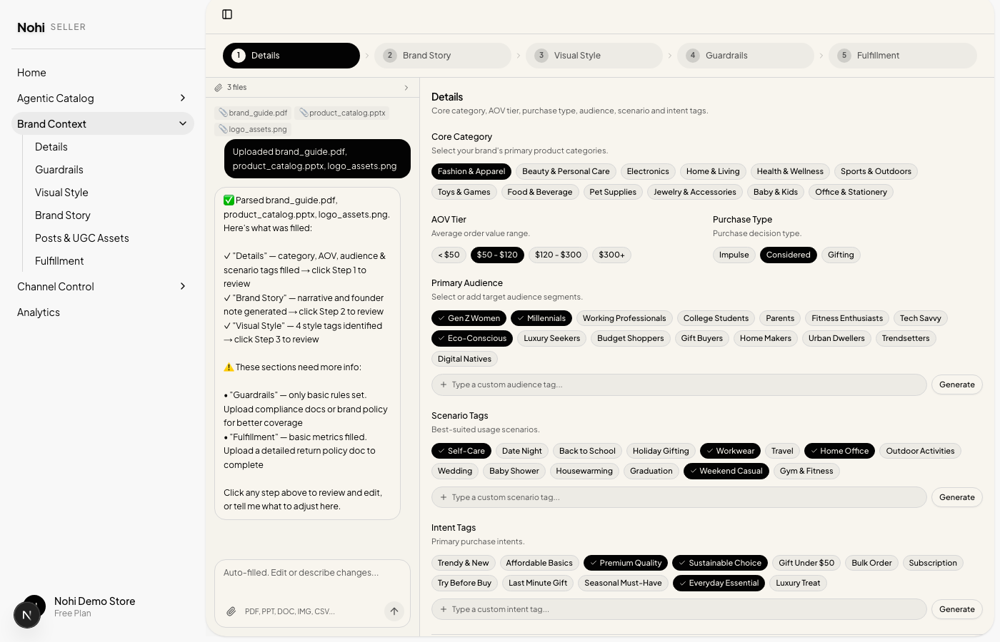
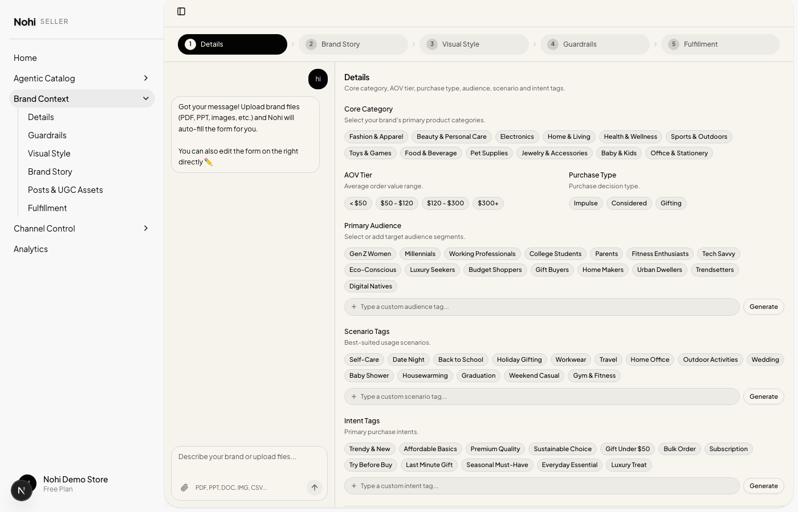
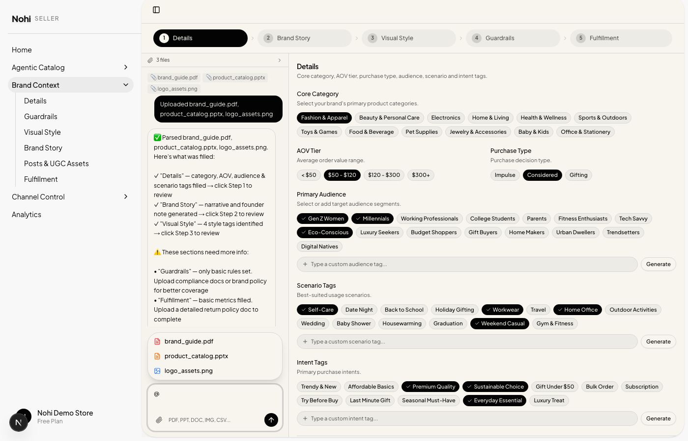
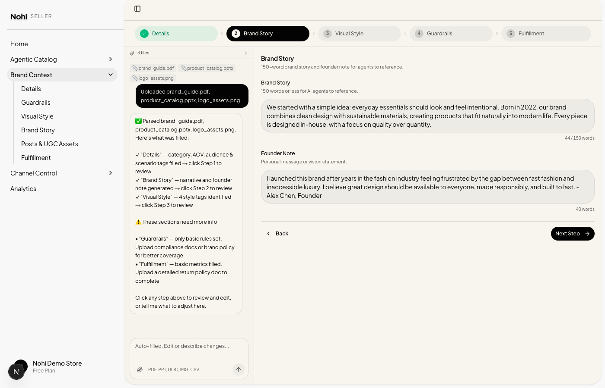
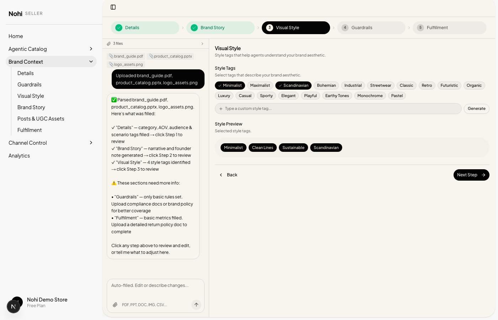
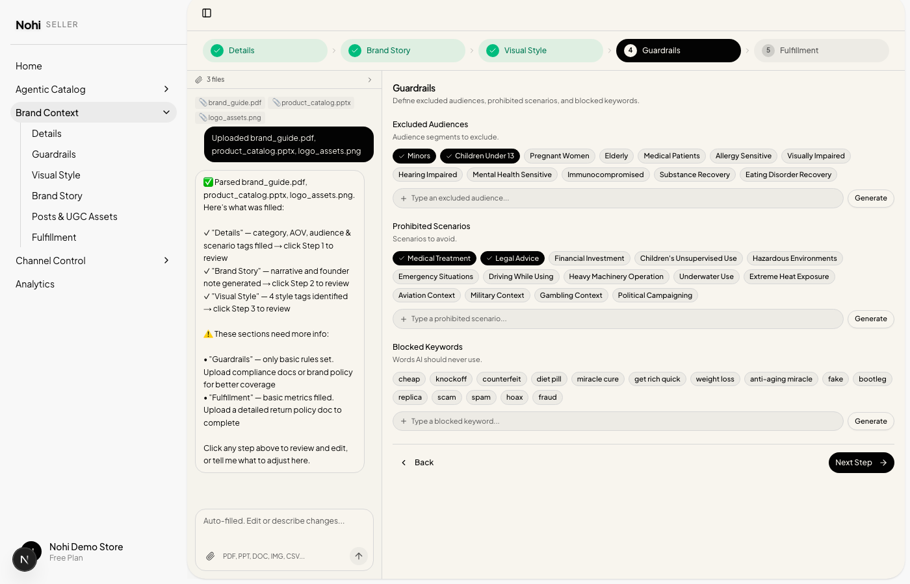
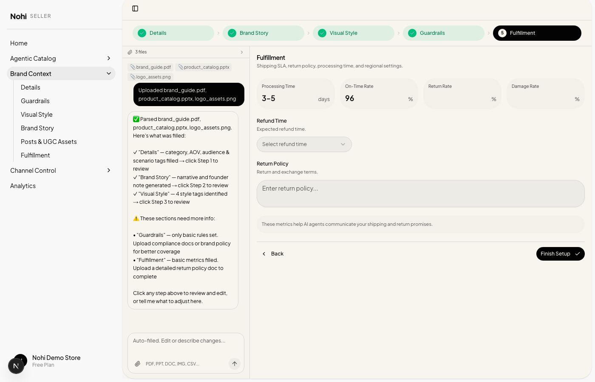

# Nohi Seller Central

> [Chinese Version / 中文版](README.zh.md)

> AI-powered seller platform for brand management, agentic catalog, channel control, and analytics.

Built with **Next.js 16**, **React 19**, **Tailwind CSS 4**, and **Radix UI**.

---

## Brand Context — AI-Assisted Brand Setup

The Brand Context module is the core brand configuration hub. Instead of a traditional multi-page form, it uses an **AI-assisted chat + form wizard** pattern — merchants upload brand files on the left, and Nohi auto-fills the structured form on the right.

### Demo



> Onboarding → file upload → auto-fill → step-by-step review

### Architecture

```
┌─────────────────────────────────────────────────────┐
│  Step Bar: Details → Brand Story → Visual Style → … │
├──────────────┬──────────────────────────────────────┤
│  Chat Panel  │         Form Wizard (scrollable)     │
│  (300px)     │         (flex-1)                     │
│              │                                      │
│  Guide Card  │  Step 1: Core Category, AOV,         │
│  or Chat     │          Audience, Scenario, Intent  │
│  Messages    │  Step 2: Brand Story, Founder Note   │
│              │  Step 3: Style Tags, Preview         │
│  ──────────  │  Step 4: Excluded Audiences,         │
│  Input Box   │          Prohibited Scenarios,       │
│  (Claude-    │          Blocked Keywords            │
│   style)     │  Step 5: Processing Time, Return     │
│              │          Policy, Metrics             │
└──────────────┴──────────────────────────────────────┘
```

### Key Features

#### 1. Onboarding Guide Card
When the merchant first lands on the page, a handwriting-style card warmly welcomes them and explains how to use the tool:
- Paste or attach brand files in the input below
- Nohi will read through them and auto-fill all form steps
- Or skip and edit the form directly



#### 2. File Upload — Paste, Attach, or Drop
The combined input supports multiple ways to add files:
- **Paste**: `Ctrl/Cmd+V` files directly into the textarea
- **Attach**: Click the paperclip button to open file picker
- **Supported formats**: PDF, PPT, DOC, images (PNG/JPG/SVG), CSV, XLSX, TXT

Files appear as removable chips inside the input area before sending.



#### 3. AI Auto-Fill — All Steps at Once
When files are sent, Nohi parses them and fills **all 5 steps simultaneously**:

| Step | What Gets Filled |
|------|-----------------|
| Details | Core category, AOV tier, purchase type, audience/scenario/intent tags |
| Brand Story | 150-word narrative + founder note |
| Visual Style | Style tags (Minimalist, Scandinavian, etc.) |
| Guardrails | Excluded audiences, prohibited scenarios, blocked keywords |
| Fulfillment | Processing time, on-time rate, return metrics |

> **Principle: Preserve original wording.** Nohi prioritizes the merchant's own language and expressions when filling form fields — brand stories, founder notes, and taglines are extracted as close to the original source material as possible, rather than being rewritten or paraphrased by AI. This ensures the brand voice stays authentic.

The AI response shows a detailed breakdown:
- **Filled sections** with direct links to each step for review
- **Incomplete sections** with suggestions for what additional files to upload



#### 4. Smart Conversation Logic

The chat handles different scenarios intelligently:

| User Action | Nohi Response | Form Effect |
|-------------|--------------|-------------|
| **Upload files (PDF/PPT/IMG...)** | Parses all files, shows detailed breakdown of what was filled vs. what's still missing, suggests additional uploads | Auto-fills ALL 5 steps at once |
| **Text-only (no files yet)** | Nohi tries to extract brand info from the text (links, brand name, category, etc.) and fills matching fields; for anything it can't identify, it guides the user to upload files | Fills fields where info is extractable, otherwise no changes |
| **Text-only (files already uploaded)** | Nohi edits the relevant fields based on the user's description; supports `@` file references for targeted re-parsing | Updates the specified fields |
| **Type `@` in input** | File picker dropdown appears — click a file to insert `@filename` reference for targeted updates | Combined with text description, updates the specified fields |

**Scenario A: Text-only message without files** — Nohi extracts what it can from the text and guides the user to upload files for the rest:



**Scenario B: @ file mention to edit fields** — After files are uploaded, type `@` to select a file and describe what to update — Nohi re-parses and updates the relevant fields:



#### 5. Collapsible File List
After uploading, files appear in a compact collapsible header at the top of the chat panel:
- Shows `"📎 3 files >"` in one line by default — minimal vertical footprint
- **Click to expand** and see individual file names, types, and sizes; click again to collapse
- Files persist across step navigation — always accessible no matter which step you're on

#### 6. Step-by-Step Wizard (Right Panel)
Each step preserves the original form design:
- **TagInput** component with tag clouds, custom tags, and "Generate more" overlay
- **Button selectors** for categories, AOV tiers, purchase types
- **Textareas** with word counts for brand story / founder note
- **Metric inputs** for fulfillment SLA numbers
- **Select dropdowns** for refund time
- Independent scrolling — right panel scrolls separately from left chat






#### 7. Bilingual Support (EN / ZH)
All text — guide cards, placeholders, AI responses, form labels — supports English and Chinese via `useLanguage()` hook. The language auto-detects from user settings.

### Interaction Flow

**Step 1: Landing**
- Welcome guide card is shown, form is empty
- User can upload files or type text

**Step 2: First Interaction**

| Method | Behavior |
|--------|----------|
| Upload files | Nohi parses file content and auto-fills all 5 form steps at once |
| Type text (with brand info/links) | Nohi extracts brand info from the text and fills matching fields; suggests uploading files for the rest |
| Type text (no brand info) | Nohi guides the user to upload files, or to edit the form directly |

**Step 3: Review & Edit**
- Click through the step bar to review auto-filled content
- Edit any field directly in the right panel
- Use `@filename` in chat to reference an uploaded file, describe what to change — Nohi re-parses and updates the relevant fields

### File Structure

```
app/seller/brand-context/
  page.tsx              # Main page — chat + form wizard

components/seller/
  tag-input.tsx         # TagInput with tag cloud + Generate overlay
  simple-tag-input.tsx  # SimpleTagInput with suggestions dropdown
```

### Tech Stack

| Technology | Version | Usage |
|-----------|---------|-------|
| Next.js | 16.2.0 | App Router, Server/Client Components |
| React | 19 | UI rendering |
| Tailwind CSS | 4 | Styling |
| Radix UI | Latest | Select, Collapsible, ScrollArea primitives |
| Lucide React | Latest | Icons |

---

## Getting Started

```bash
npm install
npm run dev
```

Open [http://localhost:3000/seller/brand-context](http://localhost:3000/seller/brand-context) to see the Brand Context page.

---

## Other Modules

- **Agentic Catalog** — AI-powered product catalog management
- **Channel Control** — Multi-channel distribution settings
- **Analytics** — Performance dashboards and reporting

---

Built by the Nohi team.
